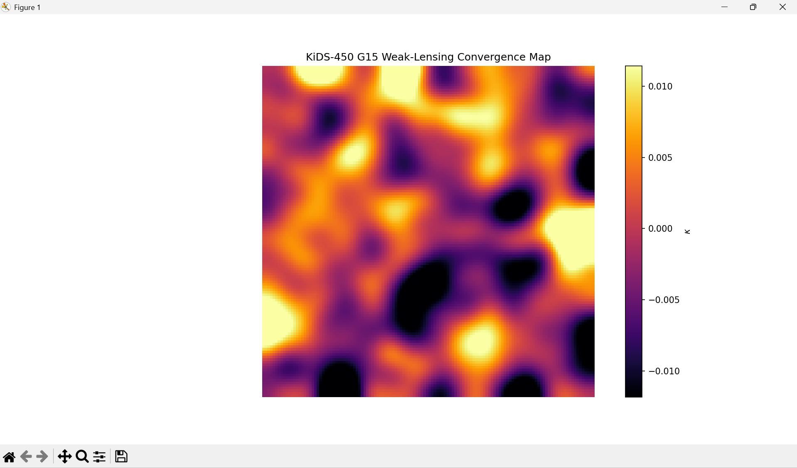

# Dark Matter Mapping from Weak Gravitational Lensing Data (KiDS)

## Overview  
This project reconstructs the **projected dark matter (convergence) field** from **weak gravitational lensing shear data** using observations from the **Kilo-Degree Survey (KiDS)**. By statistically inverting distortions in galaxy shapes, we infer the underlying mass distribution using the **Kaiser–Squires method**.  

The analysis uses real survey data that includes shear measurements for over **200,000 galaxies**. This demonstrates a complete weak-lensing pipeline from raw catalogs to convergence maps. 

---
## Results

**Figure 1:** Reconstructed convergence \( \kappa \) map from KiDS weak-lensing data, tracing the projected dark matter distribution in the selected sky patch. The map is smoothed for visualization.
